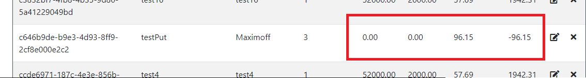
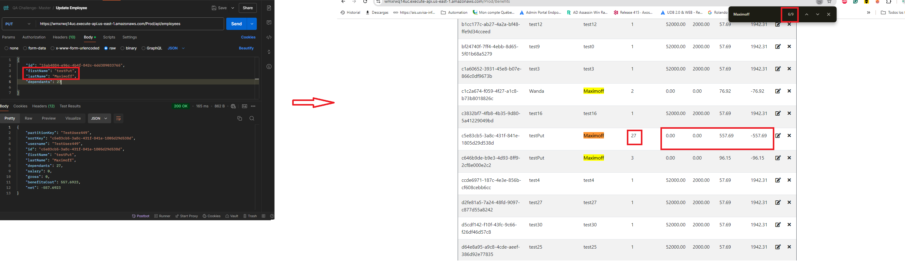

# Bug Report - Paylocity API Bug Challenge

## 1. Inconsistent API Response for Missing "Dependents" Field

### Priority: High
### Severity: Major

### Description
When validating the API for the "employees" endpoint, sending requests without data for the "First Name" and "Last Name" fields returns a response with an appropriate error message in the preview. However, when sending a request without data for the "Dependents" field, the preview displays a blank page instead of an error message. This inconsistency in response handling may lead to confusion and potential issues in client-side error handling.

### Environment
- **API Endpoint:** /employees
- **Tool:** Chrome Developer Tools (Network tab)
- **Environment:** Development
- **Application Version:** 1.2.0

### Steps to Reproduce
1. Open the application and navigate to the employee creation section.
2. Use the browser's developer tools and navigate to the "Network" tab.
3. Attempt to create an employee via the API.
4. Leave the "First Name" and "Last Name" fields empty and observe the preview response.
5. Leave the "Dependents" field empty and observe the preview response.

### Actual Result
- For "First Name" and "Last Name" fields left empty, the API returns an error message in the response preview as expected.
- For the "Dependents" field left empty, the response preview shows a blank page.

### Expected Result
The API should return a consistent error message for all required fields, including the "Dependents" field, when data is missing.

### Evidence
- **First Name and Last Name Error Response:** 
- **Dependents Field Blank Response:** 

### Impact Severity
This inconsistency can lead to difficulties in client-side error handling and potential confusion for developers or users interacting with the API. The lack of a proper error message for missing required fields can result in incomplete data being processed or errors not being handled properly.

### Additional Notes
Consider reviewing the validation logic for the "Dependents" field in the API to ensure that it provides consistent error responses similar to other required fields like "First Name" and "Last Name".

---

## 2. Exposure of Database Keys in API Response

### Priority: High
### Severity: Major

### Description
The API response for the "employees" endpoint exposes internal database keys (`partitionKey` and `sortKey`). This information reveals internal implementation details of the backend database, which can be exploited by an attacker to gain insights into the structure and potentially manipulate data.

### Environment
- **API Endpoint:** /employees
- **Environment:** Development
- **Application Version:** 1.2.0

### Steps to Reproduce
1. Send a POST request to the "employees" endpoint to add a new employee.
2. Observe the API response, which includes `partitionKey` and `sortKey` in the returned data.

### Actual Result
The API response contains the fields `partitionKey` and `sortKey`.

### Expected Result
The API response should not include internal database keys that reveal backend implementation details.

### Evidence
- **API Response with Database Keys:** 

### Impact Severity
Exposing internal database keys can lead to security vulnerabilities, as attackers can use this information to understand the database structure and potentially find ways to exploit it.

### Additional Notes
Remove the `partitionKey` and `sortKey` fields from the API response to protect backend implementation details.

---

## 3. Exposed Employee Identifier in API Response

### Priority: Medium
### Severity: Major

### Description
The API response for adding or retrieving an employee exposes the unique identifier (`id`) of the employee. While it may be necessary for internal processes, exposing this identifier could lead to security risks if an attacker can use it to access or modify sensitive data.

### Environment
- **API Endpoint:** /employees
- **Environment:** Development
- **Application Version:** 1.2.0

### Steps to Reproduce
1. Send a POST request to the "employees" endpoint to add a new employee.
2. Observe the API response, which includes the employee `id`.

### Actual Result
The API response contains the employee `id` field.

### Expected Result
The `id` field should be used internally, and the response should instead use an opaque identifier if needed.

### Evidence
- **API Response with Employee ID:** 

### Impact Severity
Exposing internal employee identifiers can be exploited by an attacker to perform unauthorized actions, such as modifying employee data or accessing sensitive information.

### Additional Notes
Consider using an opaque identifier in the response, and ensure that access to employee data is restricted based on appropriate permissions.

---

## 4. Special Characters Allowed in "First Name" Field

### Priority: Medium
### Severity: Minor

### Description
The "First Name" field allows special characters (e.g., `@`, `#`, `!`). This field is intended for personal names, and allowing special characters could lead to invalid data being stored in the system, which may affect data integrity and usability.

### Environment
- **API Endpoint:** /employees
- **Tool:** Chrome Developer Tools (Network tab)
- **Environment:** Development
- **Application Version:** 1.2.0

### Steps to Reproduce
1. Open the application and navigate to the employee creation section.
2. Enter special characters (e.g., `@`, `#`, `!`) in the "First Name" field.
3. Submit the form to create an employee.

### Actual Result
The system allows the entry of special characters in the "First Name" field without any validation error.

### Expected Result
The system should restrict the "First Name" field to only accept alphabetic characters and spaces, ensuring valid name entries.

### Evidence
- **Screenshot of Special Characters in Name Field:** 

### Impact Severity
Allowing special characters in the name field can lead to data integrity issues and make it difficult for users to recognize or correctly process employee information.

### Additional Notes
Consider adding validation to the "First Name" field to ensure only valid alphabetic characters are accepted.

---

## 5. Special Characters Allowed in "Last Name" Field

### Priority: Medium
### Severity: Minor

### Description
The "Last Name" field allows special characters (e.g., `@`, `#`, `!`). This field is intended for personal names, and allowing special characters could lead to invalid data being stored in the system, which may affect data integrity and usability.

### Environment
- **API Endpoint:** /employees
- **Tool:** Chrome Developer Tools (Network tab)
- **Environment:** Development
- **Application Version:** 1.2.0

### Steps to Reproduce
1. Open the application and navigate to the employee creation section.
2. Enter special characters (e.g., `@`, `#`, `!`) in the "Last Name" field.
3. Submit the form to create an employee.

### Actual Result
The system allows the entry of special characters in the "Last Name" field without any validation error.

### Expected Result
The system should restrict the "Last Name" field to only accept alphabetic characters and spaces, ensuring valid name entries.

### Evidence
- **Screenshot of Special Characters in Name Field:** 

### Impact Severity
Allowing special characters in the name field can lead to data integrity issues and make it difficult for users to recognize or correctly process employee information.

### Additional Notes
Consider adding validation to the "Last Name" field to ensure only valid alphabetic characters are accepted.

---

## 6. Missing Response Body for GET Employee Endpoint

### Priority: High
### Severity: Major

### Description
The API for retrieving employee information (`GET /employees/{id}`) returns a `200 OK` status but does not include a response body. This makes it difficult for the client application to process the employee data and may result in missing or incomplete information being displayed to the user.

### Environment
- **API Endpoint:** /employees/{id}
- **Tool:** Chrome Developer Tools (Network tab)
- **Environment:** Development
- **Application Version:** 1.2.0

### Steps to Reproduce
1. Send a GET request to the `/employees/{id}` endpoint with a valid employee ID.
2. Observe the response from the API.

### Actual Result
The API returns a `200 OK` status with an empty response body.

### Expected Result
The API should return a `200 OK` status along with the employee details in the response body.

### Evidence
- **Screenshot of GET Employee Response:** 

### Impact Severity
Returning an empty response body with a `200 OK` status can cause issues in the client application, such as missing employee data or errors when attempting to process the response. This negatively affects the user experience and can lead to confusion or incorrect information being displayed.

### Additional Notes
Ensure that the GET employee endpoint returns a complete response body containing the employee details for valid requests.

---

## 7. PUT Employee Endpoint Sets Salary to 0

### Priority: High
### Severity: Major

### Description
When performing a `PUT` request to update employee information, the API sets the `salary` field to `0` even if no modifications to the salary are provided in the request. This leads to incorrect employee salary data being saved.

### Environment
- **API Endpoint:** /employees
- **Tool:** Chrome Developer Tools (Network tab)
- **Environment:** Development
- **Application Version:** 1.2.0

### Steps to Reproduce
1. Send a `PUT` request to the `/employees` endpoint with valid employee data, excluding modifications to the `salary` field.
2. Include the `id` of the employee in the request body.
3. Observe the response and verify the value of `salary` after the update.

### Actual Result
The `salary` field is set to `0` after the `PUT` request.

### Expected Result
The `salary` field should retain its original value if no modifications are provided in the request.

### Evidence
- **Screenshot of PUT Employee Response:** 
- **Screenshot of PUT Employee Response:** 

### Impact Severity
Setting the `salary` to `0` can cause incorrect payroll calculations and lead to financial discrepancies for the employee.

### Additional Notes
Ensure that fields that are not modified in the request retain their original values.

---

## 8. PUT Employee Endpoint Sets Gross Pay to 0

### Priority: High
### Severity: Major

### Description
When performing a `PUT` request to update employee information, the API sets the `gross pay` field to `0` even if no modifications to the gross pay are provided in the request. This leads to incorrect employee financial data being saved.

### Environment
- **API Endpoint:** /employees
- **Tool:** Chrome Developer Tools (Network tab)
- **Environment:** Development
- **Application Version:** 1.2.0

### Steps to Reproduce
1. Send a `PUT` request to the `/employees` endpoint with valid employee data, excluding modifications to the `gross pay` field.
2. Include the `id` of the employee in the request body.
3. Observe the response and verify the value of `gross pay` after the update.

### Actual Result
The `gross pay` field is set to `0` after the `PUT` request.

### Expected Result
The `gross pay` field should retain its original value if no modifications are provided in the request.

### Evidence
- **Screenshot of PUT Employee Response:** 
- **Screenshot of PUT Employee Response:** 

### Impact Severity
Setting the `gross pay` to `0` can lead to incorrect payroll processing and financial discrepancies for the employee.

### Additional Notes
Ensure that fields that are not modified in the request retain their original values.

---

## 9. Incorrect Default Values for Benefits Cost and Net Pay after PUT Request

### Priority: High
### Severity: Major

### Description
When performing a `PUT` request to update employee information, the API sets the `benefits cost` to `76.92` and the `net pay` to `-76.92` by default, even if no modifications to these fields are provided in the request. This leads to incorrect financial data being saved for the employee.

### Environment
- **API Endpoint:** /employees
- **Tool:** Chrome Developer Tools (Network tab)
- **Environment:** Development
- **Application Version:** 1.2.0

### Steps to Reproduce
1. Send a `PUT` request to the `/employees` endpoint with valid employee data, excluding modifications to the `benefits cost` and `net pay` fields.
2. Include the `id` of the employee in the request body.
3. Observe the response and verify the values of `benefits cost` and `net pay` after the update.

### Actual Result
The `benefits cost` is set to `76.92` and the `net pay` is set to `-76.92` after the `PUT` request.

### Expected Result
The `benefits cost` and `net pay` fields should retain their original values if no modifications are provided in the request.

### Evidence
- **Screenshot of PUT Employee Response:** 
- **Screenshot of PUT Employee Response:** 

### Impact Severity
Setting incorrect default values for `benefits cost` and `net pay` can lead to financial discrepancies and incorrect payroll processing for the employee.

### Additional Notes
Ensure that fields that are not modified in the request retain their original values.

---

## 10. PUT Employee Endpoint Changes SortKey and ID

### Priority: High
### Severity: Major

### Description
When performing a `PUT` request to update employee information, the API changes the `sortKey` and `id` fields after executing the request. The `sortKey` and `id` should remain constant as they are unique identifiers for the employee. Changing these values upon an update can lead to data inconsistency and issues in maintaining proper references to the employee record.

### Environment
- **API Endpoint:** /employees
- **Tool:** Chrome Developer Tools (Network tab)
- **Environment:** Development
- **Application Version:** 1.2.0

### Steps to Reproduce
1. Send a `PUT` request to the `/employees` endpoint with valid employee data, including the `id` in the request body.
2. Observe the response and verify the values of `sortKey` and `id` after the update.

### Actual Result
The `sortKey` and `id` fields are changed after the `PUT` request, with both fields containing the same new data.

### Expected Result
The `sortKey` and `id` fields should remain unchanged after an update request, as they are used to uniquely identify the employee.

### Evidence
- **Screenshot of PUT Employee Response:** 

### Impact Severity
Changing unique identifiers can lead to data inconsistency, loss of references, and potential errors when other parts of the system attempt to access the employee record using the original `id` or `sortKey`.

### Additional Notes
Ensure that the `sortKey` and `id` fields are not modified during an update operation to maintain data consistency and integrity.

---

## 11. DELETE Employee Endpoint Allows Deletion with Non-Existent ID

### Priority: Medium
### Severity: Major

### Description
The `DELETE` request to remove an employee allows the operation to succeed even when using a non-existent `id`. The API should return an appropriate error response indicating that the employee with the provided `id` does not exist.

### Environment
- **API Endpoint:** /employees/{id}
- **Tool:** Chrome Developer Tools (Network tab)
- **Environment:** Development
- **Application Version:** 1.2.0

### Steps to Reproduce
1. Send a `DELETE` request to the `/employees/{id}` endpoint with a non-existent `id`.
2. Observe the response status and result.

### Actual Result
The `DELETE` request returns a success status (`200 OK`) even when using an `id` that does not exist in the database.

### Expected Result
The API should return an error response, such as `404 Not Found`, indicating that the employee with the given `id` does not exist.

### Evidence
- **Screenshot of DELETE Employee Response:** 

### Impact Severity
Allowing the deletion of non-existent employees may lead to confusion and incorrect assumptions about the state of the data. It may also impact system integrity and error handling processes.

### Additional Notes
Consider adding validation to ensure that the employee exists before processing the `DELETE` request, and return an appropriate error response if the employee is not found.

------------

## 12. PUT Employee Creates New Record with Incorrect Values When ID Does Not Exist

### Priority: High
### Severity: Major

### Description
When executing a `PUT` request to update employee information using an `id` that does not exist, the API incorrectly creates a new employee record with `salary` set to `0`, `gross pay` set to `0`, and incorrect values for `benefits cost` and `net pay`. This behavior results in unintended data creation with invalid financial values, which can lead to data integrity issues and incorrect payroll calculations.

### Environment
- **API Endpoint:** /employees
- **Tool:** Chrome Developer Tools (Network tab)
- **Environment:** Development
- **Application Version:** 1.2.0

### Steps to Reproduce
1. Send a `PUT` request to the `/employees` endpoint with valid employee data, but use an `id` that does not exist in the database.
2. Observe the response and the newly created employee record.

### Actual Result
The API creates a new employee record with `salary` set to `0`, `gross pay` set to `0`, and incorrect values for `benefits cost` and `net pay`.

### Expected Result
The API should return an error response, such as `404 Not Found`, indicating that the employee with the given `id` does not exist.

### Evidence
- **Screenshot of PUT Employee Response with Non-Existent ID:** 

### Impact Severity
Creating new records when the specified `id` does not exist can lead to data duplication, inconsistencies, and incorrect financial data being stored, resulting in potential payroll issues and confusion for users.

### Additional Notes
Consider adding validation to ensure that the specified employee exists before processing the `PUT` request. If the employee does not exist, the API should return an appropriate error response to prevent unintended data creation.