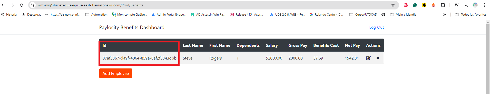
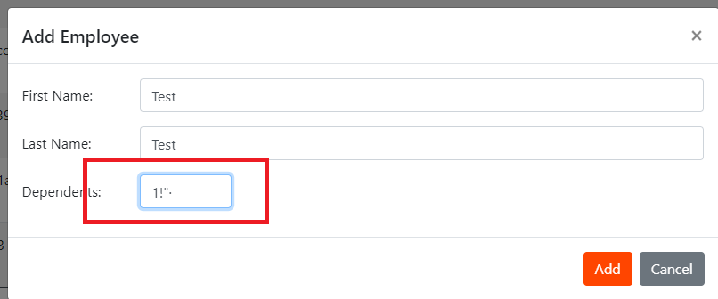
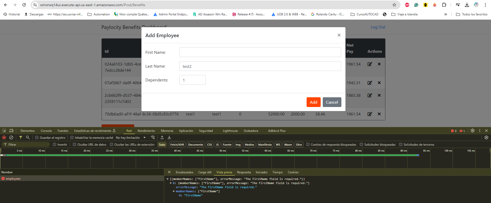
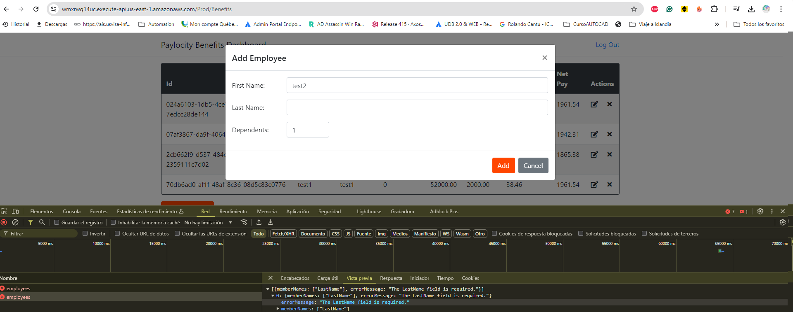
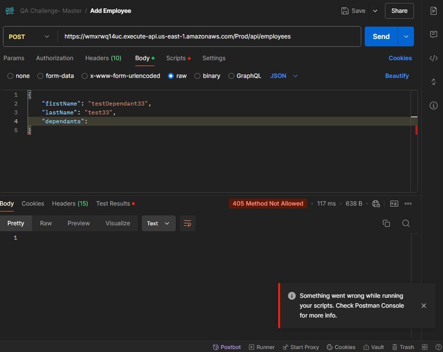
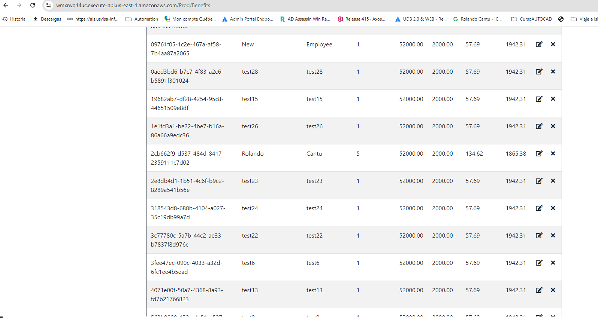
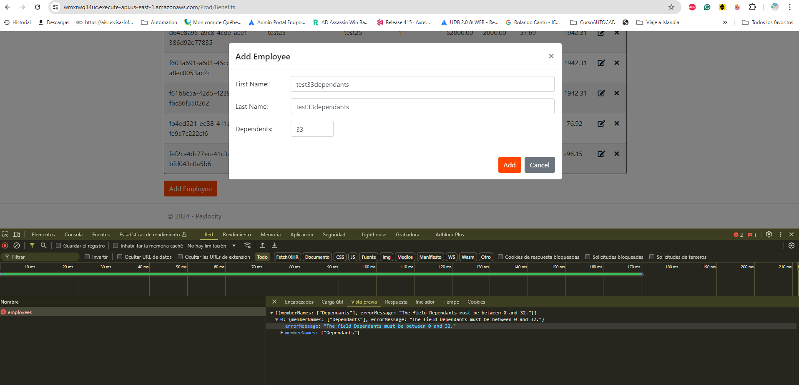

# Bug Report - Paylocity Bug Challenge

## 1. Unfriendly UUID Display in Employee Table

### Priority: Medium
### Severity: Minor

### Description
The system displays the employee ID in the table as a UUID (`07af3867-da9f-4064-859a-8af2f5343dbb`). This format is not user-friendly and may confuse end users. It would be better to display a more readable identifier, such as a sequential employee number or a shortened version of the UUID.

### Environment
- **Browser:** Chrome 114.0
- **Operating System:** Windows 10
- **Environment:** Development
- **Application Version:** 1.2.0

### Steps to Reproduce
1. Log in to the application.
2. Navigate to the "Benefits Dashboard" page.
3. Observe the employee table with employee IDs displayed as UUIDs.

### Actual Result
The employee ID is displayed as a UUID (`07af3867-da9f-4064-859a-8af2f5343dbb`).

### Expected Result
The employee ID should be displayed in a more readable format, such as a sequential number or a shortened version of the UUID.

### Evidence
- 

### Impact Severity
The current format of the employee ID is not user-friendly and could lead to confusion for users trying to identify employees easily.

### Additional Notes
Consider implementing a more user-friendly identifier for displaying in the UI, such as a sequential ID or an alias for the UUID.

---

## 2. Dependents Field Allows Special Characters

### Priority: Medium
### Severity: Minor

### Description
The "Dependents" field accepts normal numeric characters as expected, but also allows special characters (e.g., `@`, `#`, `!`). This may lead to invalid data being stored and cause issues in benefit calculations or reporting.

### Environment
- **Browser:** Chrome 114.0
- **Operating System:** Windows 10
- **Environment:** Development
- **Application Version:** 1.2.0

### Steps to Reproduce
1. Log in to the application.
2. Navigate to the "Benefits Dashboard" page.
3. Attempt to add a new employee.
4. Enter special characters (e.g., `@`, `#`, `!`) in the "Dependents" field.
5. Save the employee details.

### Actual Result
The system allows special characters in the "Dependents" field without any validation error.

### Expected Result
The system should restrict the "Dependents" field to only accept numeric values, as dependents should be represented by a count.

### Evidence
- 

### Impact Severity
Allowing special characters in the "Dependents" field could lead to data integrity issues and incorrect calculations for employee benefits.

### Additional Notes
Consider adding validation to the "Dependents" field to only accept numeric values.

---

## 3. Missing Required Field Error for First Name

### Priority: High
### Severity: Major

### Description
The system does not display an error message when the "First Name" field is left empty during the employee creation process. This could lead to incomplete employee records being saved without the required information.

### Environment
- **Browser:** Chrome 114.0
- **Operating System:** Windows 10
- **Environment:** Development
- **Application Version:** 1.2.0

### Steps to Reproduce
1. Log in to the application.
2. Navigate to the "Benefits Dashboard" page.
3. Attempt to add a new employee.
4. Leave the "First Name" field empty.
5. Save the employee details.

### Actual Result
The system allows the employee details to be saved without displaying any error message for the missing "First Name" field.

### Expected Result
The system should display an error message indicating that the "First Name" field is required.

### Evidence
- 

### Impact Severity
Missing validation for required fields could lead to incomplete and incorrect employee data, affecting various functionalities dependent on accurate employee information.

### Additional Notes
Consider adding a required field validation for the "First Name" field to ensure data completeness.

---

## 4. Missing Required Field Error for Last Name

### Priority: High
### Severity: Major

### Description
The system does not display an error message when the "Last Name" field is left empty during the employee creation process. This could lead to incomplete employee records being saved without the required information.

### Environment
- **Browser:** Chrome 114.0
- **Operating System:** Windows 10
- **Environment:** Development
- **Application Version:** 1.2.0

### Steps to Reproduce
1. Log in to the application.
2. Navigate to the "Benefits Dashboard" page.
3. Attempt to add a new employee.
4. Leave the "Last Name" field empty.
5. Save the employee details.

### Actual Result
The system allows the employee details to be saved without displaying any error message for the missing "Last Name" field.

### Expected Result
The system should display an error message indicating that the "Last Name" field is required.

### Evidence
- 

### Impact Severity
Missing validation for required fields could lead to incomplete and incorrect employee data, affecting various functionalities dependent on accurate employee information.

### Additional Notes
Consider adding a required field validation for the "Last Name" field to ensure data completeness.

---

## 5. Missing Required Field Error for Dependents

### Priority: High
### Severity: Major

### Description
The system does not display an error message when the "Dependents" field is left empty or contains invalid data during the employee creation process. This could lead to incomplete employee records being saved without the required information.

### Environment
- **Browser:** Chrome 114.0
- **Operating System:** Windows 10
- **Environment:** Development
- **Application Version:** 1.2.0

### Steps to Reproduce
1. Log in to the application.
2. Navigate to the "Benefits Dashboard" page.
3. Attempt to add a new employee.
4. Leave the "Dependents" field empty or enter invalid data.
5. Save the employee details.

### Actual Result
The system allows the employee details to be saved without displaying any error message for the missing or invalid "Dependents" field.

### Expected Result
The system should display an error message indicating that the "Dependents" field is required and should contain valid numeric data.

### Evidence
- 

### Impact Severity
Missing validation for required fields could lead to incomplete and incorrect employee data, affecting various functionalities dependent on accurate employee information.

### Additional Notes
Consider adding a required field validation for the "Dependents" field to ensure data completeness and correctness.

----------------

## 6. No Redirection to Login after Token Timeout

### Priority: High
### Severity: Major

### Description
After the login token times out, the application does not redirect the user to the login page. Instead, the user remains on the dashboard, but the information is not displayed, and the logout button disappears. This leads to a confusing user experience as the user is not informed that their session has expired.

### Environment
- **Browser:** Chrome 114.0
- **Operating System:** Windows 10
- **Environment:** Development
- **Application Version:** 1.2.0

### Steps to Reproduce
1. Log in to the application.
2. Wait for the login token to time out.
3. Observe the application behavior on the dashboard.

### Actual Result
The user remains on the dashboard without any displayed information, and the logout button disappears.

### Expected Result
The user should be redirected to the login page after the token times out, with a message indicating that the session has expired.

### Evidence
- [Screenshot for dashboard time out ](./dashboard_timeoutToken_ui.png)

### Impact Severity
Not redirecting the user after the token timeout can cause confusion, as the user is unaware of the session status and cannot log out properly.

### Additional Notes
Consider implementing an automatic redirection to the login page with an appropriate session expiration message once the token times out.

-------------------

## 7. Dashboard Table Data Not Organized

### Priority: Medium
### Severity: Minor

### Description
The data in the table displayed on the dashboard is not organized in a consistent or logical order. This makes it difficult for users to quickly locate specific information, reducing the usability and efficiency of the dashboard.

### Environment
- **Browser:** Chrome 114.0
- **Operating System:** Windows 10
- **Environment:** Development
- **Application Version:** 1.2.0

### Steps to Reproduce
1. Log in to the application.
2. Navigate to the dashboard.
3. Observe the order of the data in the table.

### Actual Result
The data in the table appears to be unordered, making it hard for users to quickly find specific entries.

### Expected Result
The data in the table should be organized in a logical order, such as by employee name, ID, or another relevant field, to improve user experience.

### Evidence
- 

### Impact Severity
Disorganized data can lead to a poor user experience, as users must spend additional time searching for information.

### Additional Notes
Consider implementing a default sorting mechanism for the table, such as alphabetical order or sorting by a specific key field, to improve usability.

---------

## 8. No Error Message for Maximum Dependents Exceeded

### Priority: High
### Severity: Major

### Description
When setting the number of dependents to the maximum value of `33`, the expected error message "The field Dependents must be between 0 and 32." does not appear in the UI. This can lead to invalid data being entered without proper feedback to the user.

### Environment
- **Browser:** Chrome 114.0
- **Operating System:** Windows 10
- **Environment:** Development
- **Application Version:** 1.2.0

### Steps to Reproduce
1. Log in to the application.
2. Navigate to the employee creation or edit form.
3. Set the number of dependents to `33`.
4. Save the employee details.

### Actual Result
No error message is displayed, and the form appears to accept the invalid number of dependents.

### Expected Result
An error message should be displayed indicating "The field Dependents must be between 0 and 32." to prevent invalid data from being submitted.

### Evidence
- **Screenshot of Form with Dependents Set to 33:** 

### Impact Severity
Allowing users to set an invalid number of dependents without providing an error message leads to data integrity issues and a poor user experience.

### Additional Notes
Consider adding validation logic in the UI to ensure that the number of dependents is constrained between `0` and `32`, with appropriate error messaging.